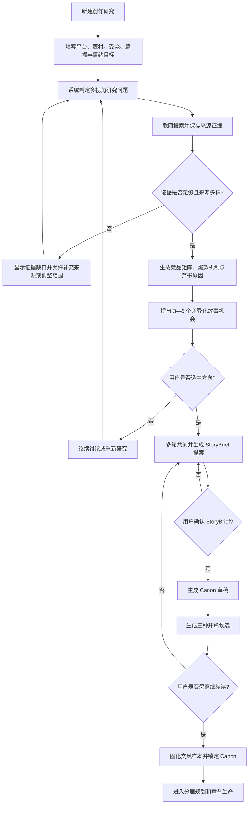
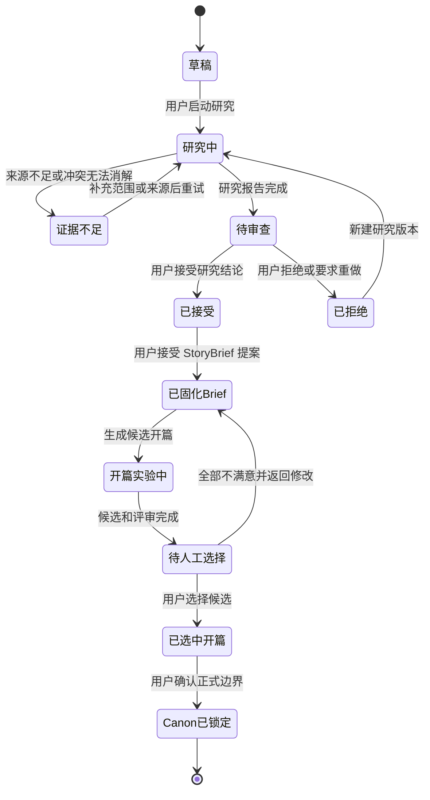

# 第十三阶段重制：市场研究、故事孵化与开篇实验室

## 1. 背景与阶段目标

《夜巡人》真实试写已经证明：现有系统能够保存 Canon、约束章节、连续生产、质量复核和恢复任务，但“逻辑正确”不等于“有人愿意读”。第 1—9 章作为工程验收作品可以通过现有质量门，却出现了开头缺乏吸引力、档案编号重复、解释多于场景、人物欲望弱和语言干涩等根本问题。

第十三阶段因此不再以“通用 Canon 生成器”为起点，而是补齐小说生产前最重要的决策层：

```text
市场与读者目标
→ 有来源的竞品研究
→ 爆款机制与弃书原因拆解
→ 差异化故事机会
→ 人机多轮共创
→ 权威 StoryBrief
→ Canon 草稿
→ 三种开篇实验
→ 人工确认愿意继续读
→ 锁定 Canon / 文风基线
→ 进入规划与自动写作
```

本阶段不能承诺“制造爆款”。产品目标是提高选题和开篇成功概率、暴露明显失败方向，并确保市场结论可追溯、创意不直接复制竞品。

《夜巡人·正式试写》停在第 9 章，保留为失败样本与回归数据，不继续付费生成，不作为新系统的默认模板。

## 2. 用户旅程



### 2.1 关键状态机



## 3. 产品边界

### 3.1 本阶段包含

- 可配置目标平台、读者、题材、长短篇、目标字数与情绪价值。
- 可插拔的网页搜索与页面正文提取 Provider。
- 来源台账、证据片段、查询过程、研究版本和引用关系。
- 竞品卡片、共同模式、失败模式和市场机会矩阵。
- 爆款潜力评分及证据覆盖度，不输出“保证爆款”。
- 创意会话、StoryBrief 提案、接受/拒绝和版本历史。
- 通用 Canon 草稿生成，不再硬编码夜巡人体系。
- 三种开篇候选、阅读吸引力评审、人工选择和文风基线。
- 与现有 Canon、Plan、章节生产链路的受控交接。

### 3.2 本阶段不包含

- 不继续生成《夜巡人》第 10 章以后正文。
- 不自动抓取、保存或复现完整版权小说。
- 不绕过登录、付费墙、验证码、robots/站点限制或反爬措施。
- 不把榜单排名、评论数量等无法验证的信息伪装成事实。
- 不允许模型自动接受 StoryBrief、锁定 Canon 或选择开篇。
- 不开放每日自动托管；前三章必须人工选择和批准。
- 另一台电脑不修改任何 UI、CSS、设计令牌或视觉快照。

## 4. 参考架构与技术原则

研究流程借鉴以下公开项目和官方能力，但不直接复制其业务代码：

- [GPT Researcher](https://github.com/assafelovic/gpt-researcher)：把研究任务拆成查询、来源采集和带引用报告。
- [Stanford STORM / Co-STORM](https://github.com/stanford-oval/storm)：使用多视角提问和人机协同知识整理，适合作为“不同读者/编辑视角”的研究范式。
- [Tavily Search API](https://docs.tavily.com/documentation/api-reference/endpoint/search)：支持日期、域名、搜索深度和原始内容选项，可作为首个搜索 Provider。
- [Firecrawl](https://docs.firecrawl.dev/introduction)：可把公开网页转换成 Markdown 或结构化 JSON，可作为可选正文提取 Provider。

实现必须通过项目自己的接口隔离供应商：

- `SearchProvider`：搜索、时间范围、域名范围、分页、用量与错误归一化。
- `ContentFetchProvider`：读取公开页面、正文清洗、字符上限和来源元数据。
- `ResearchModel`：查询规划、证据抽取、竞品分析、机会综合。
- `ResearchSourcePolicy`：访问许可、域名规则、内容长度、版权和敏感来源拦截。

首选实现 Tavily 搜索适配器；Firecrawl 只作为可选正文提取适配器。没有密钥时返回明确的未配置状态，禁止静默生成无来源报告。所有自动测试使用确定性本地 Provider，不调用真实搜索或 DeepSeek。

## 5. 用户故事

### US-13-01：建立创作研究目标

**作为** 小说作者，**我希望** 先说明平台、受众和创作意图，**以便于** 系统研究正确的市场，而不是泛泛搜索“热门小说”。

业务规则：

- 必填：作品形态、目标平台或“尚未确定”、题材、受众、篇幅、核心情绪体验。
- 选填：参考作品、禁写内容、商业目标、更新时间范围、指定/排除域名。
- 参考作品只能作为研究对象，不得生成“模仿某作者原文文风”的指令。
- 保存草稿不启动联网研究；用户确认后创建不可变的研究目标快照。

验收：

- GIVEN 用户只有一句模糊想法，WHEN 保存草稿，THEN 系统提示缺失项但不擅自补齐。
- GIVEN 用户确认研究目标，WHEN 启动研究，THEN 后续结果冻结并引用该目标 revision/checksum。
- GIVEN 目标在研究期间被修改，WHEN 旧研究完成，THEN 结果标记为漂移且不能覆盖新目标。

未来 UI 线框：

```text
+--------------------------------------------------------------------------------+
| 市场研究室                         研究草稿                   [保存] [开始研究] |
+------------------------+--------------------------------------+----------------+
| 创作目标               | 研究范围                             | 故事 Agent     |
| 形态 [长篇 v]          | [x] 平台榜单  [x] 读者评论           | 已确认 5 项    |
| 平台 [番茄/未定 v]     | [x] 公开试读  [x] 编辑/作者分析      | 待确认 3 项    |
| 题材 [现代悬疑     ]   | 时间 [近 24 个月 v]                  | 冲突 1 项      |
| 受众 [            ]    | 指定域名 [                 ]         |                |
| 情绪 [惊惧/爽感/共鸣]  | 排除域名 [                 ]         | [继续讨论]     |
+------------------------+--------------------------------------+----------------+
```

### US-13-02：执行有证据的联网研究

**作为** 小说作者，**我希望** 每个市场结论都能追溯到公开来源，**以便于** 区分事实、评论和 AI 推断。

业务规则：

- 查询规划至少覆盖平台趋势、同题材头部作品、读者好评、弃书原因、开篇策略和连载持续性六类视角。
- 来源类型标记为：平台官方、作品公开页面、公开试读、读者评论、作者/编辑访谈、行业分析、其他。
- 每条证据保存 URL、标题、发布/抓取时间、来源类型、证据短片段、checksum 和关联结论。
- 同一 URL 去重；页面内容变更后生成新版本，不静默覆盖旧证据。
- 无法访问、付费墙、验证码、登录页和禁止访问来源记录失败原因，不尝试绕过。
- 研究报告中的事实必须有关联证据；没有证据只能标记为“AI 推断”或“待验证”。

验收：

- 至少覆盖 3 类来源且形成可点击引用；不足时状态为“证据不足”。
- 任一来源删除或抓取失败不导致已保存证据丢失；报告明确显示覆盖度下降。
- Provider 超时、限流和密钥缺失均可重试，且不会产生重复来源或重复计费记录。

### US-13-03：生成竞品与读者矩阵

**作为** 小说作者，**我希望** 看见竞品为什么吸引人和为什么被放弃，**以便于** 提炼机制而不是照抄情节。

每个竞品卡至少包含：

- 一句话阅读承诺和目标读者。
- 前三章钩子类型、主角欲望、初始困境和情绪回报。
- 世界观辨识度、冲突发动机、升级/关系/谜团的持续生产方式。
- 节奏结构、阶段性满足和章末驱动力。
- 高频好评、弃书原因、风险与证据置信度。
- 只记录抽象机制；不得保存大段原文、专有设定复刻方案或仿写指令。

验收：

- 证据不足的字段必须为空或低置信度，不能由模型补写成事实。
- “市场共同模式”和“单个作品特征”必须分开。
- 用户可以排除错误竞品并重新综合，历史报告仍可恢复。

### US-13-04：提出差异化故事机会

**作为** 小说作者，**我希望** 获得多个有依据但不雷同的故事方向，**以便于** 选择真正值得继续设计的创意。

系统生成 3—5 个方向，每个方向包含：

- 一句话高概念、核心人物、核心欲望、冲突和世界规则。
- 前三章阅读承诺、长期连载发动机和结局潜力。
- 对应市场证据、读者需求、差异化点和同质化风险。
- 爆款潜力分项：平台适配 15、开篇钩子 15、情绪回报 15、差异化 15、连载发动机 15、人物黏性 10、世界观发动机 10、可读性 5，总分 100。
- 同时显示证据覆盖度与不确定性；总分不能脱离分项证据单独使用。

任何方向都只是候选。只有用户接受的方向才能进入 StoryBrief；拒绝和继续讨论不会改变权威状态。

### US-13-05：多轮共创并固化 StoryBrief

**作为** 小说作者，**我希望** 与 Agent 逐轮调整方向，**以便于** 故事反映我的判断而不是模型一次拍板。

每轮会话展示：已确认、待确认、AI 建议、相互冲突、研究依据。StoryBrief 至少包含：

- format、platform、audience、targetChapters、targetWords、chapterWordRange。
- premise、readerPromise、theme、tone、pov、pace、endingDirection。
- protagonist、coreDesire、coreConflict、worldMechanism、serialEngine。
- emotionalRewards、differentiators、forbiddenContent、referenceTraits。
- researchReportId/checksum、acceptedOpportunityId、confirmedDecisions、openQuestions。

对话不是正式设定。只有用户接受 `StoryBriefProposal` 才生成新的 current version；拒绝不改变 current Brief。

未来 UI 线框：

```text
+--------------------------------------------------------------------------------+
| 创意共创室               当前方向：城市民俗悬疑            [固化 StoryBrief] |
+----------------------+--------------------------------------+------------------+
| 研究证据与机会       | 对话                                 | Brief 草稿       |
| 竞品矩阵             | 你：不要档案报告式叙事               | 已确认 8          |
| 高频追读原因         | Agent：给出三个人物入口……            | 待确认 4          |
| 高频弃书原因         |                                      | 冲突 1            |
| [查看来源]           | [输入讨论内容……]          [发送]     | [查看字段差异]    |
+----------------------+--------------------------------------+------------------+
```

### US-13-06：由 StoryBrief 生成通用 Canon 草稿

**作为** 小说作者，**我希望** 将已确认的故事方向变成可检查的世界权威，**以便于** 后续写作稳定但不过早僵化。

- Canon 由 current StoryBrief 驱动，冻结 Brief version、research checksum 和 opportunity id。
- 条件化生成故事内核、人物、关系、世界规则、资源/能力/职业体系、代价、秘密层级、揭示窗口、文风和禁写边界。
- 没有等级、法宝、怪异规则的题材允许标记 `notApplicable`。
- Canon 此时保持草稿，不能自动锁定，也不能直接开始 1000 章规划。
- Brief 或研究报告漂移时，旧 Canon 提案不能应用。

### US-13-07：开篇实验与阅读吸引力评审

**作为** 小说作者，**我希望** 在锁定长篇规划前比较不同开篇，**以便于** 先证明自己愿意继续读。

- 从同一 Brief/Canon 草稿生成 3 个策略不同的开篇方案：强事件、强人物、强悬念；允许用户自定义策略。
- 每个方案生成第一章；用户选出候选后才允许扩到前三章。
- 评审拆为硬质量和阅读质量。硬质量沿用设定、知识、状态和节奏边界；阅读质量检查第一屏钩子、人物欲望、情绪牵引、场景张力、解释密度、编号/术语重复、对话/动作/说明比例、章末继续阅读欲望。
- 阅读质量不得只由写作模型自评；至少使用独立“读者模拟”和“故事编辑”两种角色，并显示分歧。
- 前三章禁止自动正式提交；用户必须明确选择“愿意继续读”的候选。

验收：

- 三个候选必须有真实结构差异，不能只替换标题或同义句。
- 编号/术语重复、连续说明段、主角缺少主动欲望能够形成定位到文本的 finding。
- 所有候选均被拒绝时，系统返回 StoryBrief 共创阶段，不污染 Canon、Plan 或正式正文。
- 选中候选后生成不可变的 `StyleBaseline`，包含正文样本 checksum、抽象文风规则和禁用模式。

未来 UI 线框：

```text
+--------------------------------------------------------------------------------+
| 开篇实验室             第一章方案比较                    [全部不满意] [选中] |
+----------------------+----------------------+----------------------+-------------+
| A 强事件             | B 强人物             | C 强悬念             | 读者评审    |
| 首屏异常             | 人物困境             | 具体谜题             | 钩子 82     |
| [阅读全文]           | [阅读全文]           | [阅读全文]           | 人物 61     |
| [查看问题 3]         | [查看问题 1]         | [查看问题 2]         | 干涩度 18   |
+----------------------+----------------------+----------------------+-------------+
| 当前候选正文与定位批注                                                |
+--------------------------------------------------------------------------------+
```

### US-13-08：锁定并交接现有生产链

只有以下条件同时满足，才开放 Canon 锁定和规划：

- current StoryBrief 已接受且无 blocker。
- Canon 草稿完整性和交叉一致性通过。
- 至少一个开篇候选被用户选中。
- 前三章全部由用户人工批准。
- StyleBaseline 已建立且与当前 Brief/Canon checksum 一致。

锁定后再调用现有动态规划、ChapterBeat、章节生产和质量门。自动托管默认关闭；用户完成首批 5—10 章人工验收后才允许开启。

## 6. 后端数据模型

新增项目库表：

- `market_research_briefs`
- `research_jobs`
- `research_queries`
- `research_sources`
- `research_source_versions`
- `research_evidence`
- `competitor_profiles`
- `research_findings`
- `story_opportunities`
- `ideation_sessions`
- `ideation_messages`
- `story_brief_versions`
- `story_brief_proposals`
- `opening_experiments`
- `opening_candidates`
- `reader_evaluations`
- `style_baselines`

研究报告、机会、Brief、Canon 和开篇候选均保存 revision/checksum 和上游权威引用。模型调用、搜索调用与页面抓取在 SQLite 写事务外执行，落盘前重新校验上游 revision。

## 7. API 语义

核心接口：

- `POST/GET /api/v1/projects/{project_id}/research/briefs`
- `POST /api/v1/projects/{project_id}/research/jobs`
- `GET /api/v1/projects/{project_id}/research/jobs`
- `GET /api/v1/research/jobs/{job_id}`
- `POST /api/v1/research/jobs/{job_id}/cancel|resume`
- `GET /api/v1/research/jobs/{job_id}/sources|evidence|competitors|findings`
- `POST /api/v1/research/jobs/{job_id}/opportunities`
- `POST /api/v1/story-opportunities/{id}/accept|reject`
- `POST/GET /api/v1/projects/{project_id}/ideation/sessions`
- `POST /api/v1/ideation/sessions/{session_id}/messages`
- `POST /api/v1/ideation/sessions/{session_id}/story-brief-proposals`
- `GET /api/v1/projects/{project_id}/story-brief/versions|current`
- `POST /api/v1/story-brief-proposals/{id}/apply|reject`
- `POST/GET /api/v1/projects/{project_id}/opening-experiments`
- `POST /api/v1/opening-candidates/{id}/select|reject`
- `POST /api/v1/opening-experiments/{id}/expand-to-three-chapters`
- `GET /api/v1/projects/{project_id}/incubation-readiness`

所有写操作携带 expected revision。Provider 密钥只进入 Windows Credential Manager；API、日志、数据库、备份和导出不得出现完整密钥。

## 8. 测试与验收

必须覆盖：

- 研究目标保存、冻结、修改和 revision 漂移。
- 搜索密钥缺失、超时、限流、取消、恢复和确定性重试。
- URL 去重、页面版本、来源分类、证据引用和跨作品隔离。
- 证据不足时禁止生成确定性市场结论。
- 竞品排除后重新综合，不修改旧报告。
- 爆款潜力分项总和、证据覆盖度和不确定性一致。
- 机会接受/拒绝、StoryBrief 版本、Canon 上游漂移和原子应用。
- 三个开篇策略确有结构差异；候选不能污染正式正文。
- 阅读质量门能发现重复编号、说明段过密和人物欲望缺失。
- 前三章不能自动批准或自动提交。
- 服务重启后恢复研究、来源、会话、候选和状态。
- 备份恢复后 remap 全部新表并保持引用关系。
- 全量 API、Web 单元测试、Build、Playwright 和 `compileall` 通过。

真实验收使用一个全新项目，不复用《夜巡人》正文：

1. 输入一个模糊题材想法。
2. 完成公开网页研究并人工抽查至少 10 条引用。
3. 用户从不少于 3 个方向中选择一个。
4. 完成至少 3 轮创意讨论并接受 StoryBrief。
5. 生成 Canon 草稿与 3 个开篇。
6. 用户明确判断是否存在“愿意继续读”的版本。
7. 没有满意版本时必须返回共创，不得进入自动写作。

## 9. 协作与交付顺序

### 9.1 另一台电脑：后端实施

- 实现全部新表、迁移、服务、Provider 接口、API、恢复与测试。
- 实现 Tavily 搜索适配器和可选 Firecrawl 提取适配器，但测试不得发起真实网络调用。
- 移除生产路径夜巡人硬编码，保留为显式 demo 模板。
- 不修改 `apps/web/**`、CSS、设计令牌或视觉快照。
- 完成后提交并推送当前分支，更新 `HANDOFF.md`，停止等待审计。

### 9.2 当前电脑：GPT-5.6 审计与 UI

- 审计来源证据是否可追溯、版权边界、Provider 密钥、事务、revision、跨作品隔离和备份恢复。
- 修复后运行全量测试。
- 由当前电脑独立实现市场研究室、创意共创室和开篇实验室 UI。
- 真实 Provider 与真实开篇验收由当前电脑完成。

## 10. 发布门槛

第十三阶段只有在“全新项目中至少出现一个用户愿意继续读的开篇”后才能宣称完成。测试数量、API 通过、自动生成成功都不能替代该验收结论。
