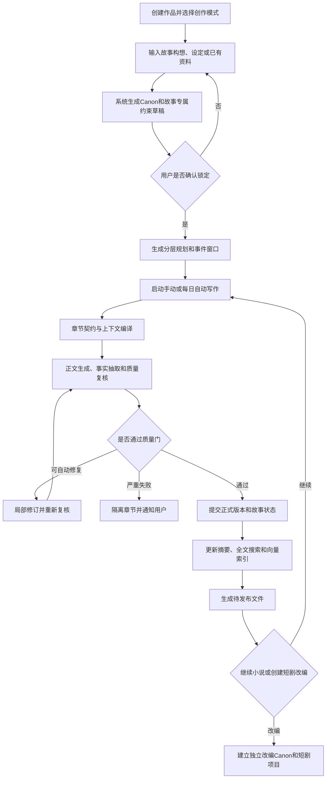
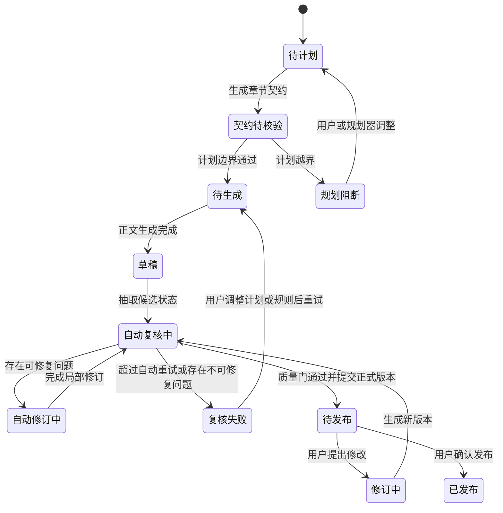
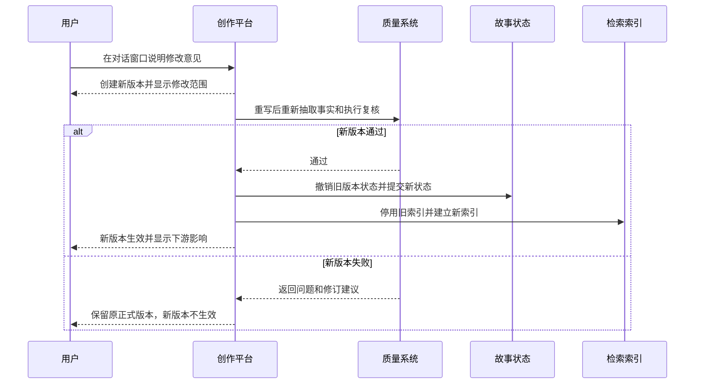

# 产品需求文档：全自动小说与短剧创作平台 - V0.1

| 项目 | 内容 |
|---|---|
| PRD编号 | PRD-001 |
| 状态 | 已确认，可进入架构设计与开发拆分 |
| 日期 | 2026-07-11 |
| 产品名称 | 待定，本文统一称“故事创作平台” |
| 产品形态 | 本地优先桌面应用，开发期以本地Web运行，稳定后封装Windows EXE |
| 首期重点 | 故事内核、长篇网文、短篇小说、自动质量闭环、版本化修订、作品导出 |
| 后续范围 | 短剧改编、分镜、角色视觉资产、图片、视频、配音、字幕和成片合成 |

## 1. 综述（Overview）

### 1.1 项目背景与核心问题

现有大模型能够快速生成单章小说，但难以独立稳定地完成几十万字到数百万字的长篇连载，主要问题包括：

1. 会话中断后遗忘人物、设定、道具、能力、时间线和伏笔。
2. 规划一百章的故事，可能在十到二十章内提前完成主要内容。
3. 人物提前出场、提前获得能力、使用尚未获得的物品，或者在不可能到达的地点出现。
4. 同一能力、法术、物品或世界规则在不同章节中发生不合理变化。
5. 正文表面通顺，但因果、人物动机、信息边界和场景动作存在逻辑错误。
6. 用户修改章节后，系统仍保留旧摘要、旧事件和旧向量记忆，导致后续写作继续引用已废弃内容。
7. 用户每天需要投入一至两小时阅读、指出问题、反复要求模型重写，无法实现真正的自动托管。
8. 小说成稿与短剧生产割裂，人物、剧情、场景和视觉资产不能持续复用。

本产品的核心目标不是“一键生成一段文字”，而是建立一个可长期运行、可验证、可回滚的故事生产系统：

> 用户完成作品意图和核心设定后，系统能够按计划每天自动完成章节规划、上下文编译、正文生成、事实抽取、逻辑检查、自动修订、状态提交和待发布文件生成；正常情况下用户只查看结果，严重异常才需要介入。

“全自动”不等于无条件放行。系统必须具备拒绝交付能力：未通过质量门的章节进入隔离状态，不得污染正式故事状态，不得被后续章节检索和引用。

#### 1.1.1 产品目标

- 支持长篇网文、短篇小说、短剧改编三种创作策略，共用同一故事内核。
- 保证作者锁定的故事规则不被模型静默修改。
- 将人物、地点、组织、物品、能力、事件、情报、关系和伏笔统一纳入状态管理。
- 通过章节窗口、里程碑和章节契约阻止剧情抢跑。
- 将程序硬校验与独立模型审稿结合，默认自动修订两轮。
- 每次正式章节提交或重写后，同步重算故事状态和检索索引。
- 支持不同任务使用不同大模型，包括中文写作模型、推理审稿模型、低成本抽取模型和Embedding模型。
- 首期生成可直接检查和发布的小说文件；后续扩展为完整短剧生产平台。

#### 1.1.2 首期成功指标

- 连续自动运行三十章时，不发生状态库损坏、章节错序或旧版本记忆污染。
- 所有进入“待发布”状态的章节不存在系统已知的严重硬规则冲突。
- 至少80%的章节在不超过两轮自动修订后进入待发布状态。
- 无异常日的人工处理时间目标不超过十分钟，主要用于抽查和发布。
- 修改最新章节后，旧版本产生的事件、摘要、状态和索引全部失效。
- 修改历史章节后，系统能够列出受影响的后续章节，不静默继续写作。

### 1.2 核心业务流程／用户旅程地图

1. **创建作品**：用户创建作品，选择长篇网文、短篇小说或短剧改编模式，配置自动化等级和目标平台。
2. **建立故事Canon**：用户输入构想、设定或参考资料，系统分析本书需要长期保持一致的实体、体系和规则，用户确认后锁定。
3. **规划故事**：系统依据创作模式生成全书、卷、剧情弧、章节或场景规划，并建立人物出场、升级、伏笔和重大事件窗口。
4. **自动写作**：系统按计划生成章节契约，编译上下文，调用指定模型写作，执行事实抽取、硬校验、独立审稿和自动修订。
5. **维护与干预**：用户在对话窗口提出修改；系统创建新版本、撤销旧状态、应用新状态、重建索引并检查下游影响。
6. **输出与衍生**：长短篇作品导出为发布文件；短篇或长篇选定剧情弧可创建短剧改编项目；后续进入剧本、分镜和成片生产。

### 1.3 Mermaid图

#### 1.3.1 核心用户操作流



#### 1.3.2 章节生命周期状态机



#### 1.3.3 用户修改章节后的状态替换



## 2. 用户故事详述（User Stories）

### 阶段一：作品创建与故事内核

---

#### **US-01：作为创作者，我希望创建作品并选择创作模式，以便系统采用正确的规划和质量策略**

**价值陈述**

- **作为** 小说与短剧创作者
- **我希望** 创建本地作品项目，选择长篇网文、短篇小说或短剧改编模式
- **以便于** 系统加载对应的规划器、审稿标准、输出格式和自动化流程

**业务规则与逻辑**

1. 用户填写作品名称、创作模式、题材、语言、目标字数或章节数、每章目标字数和目标平台。
2. 用户选择自动化等级：
   - 手动：每个关键步骤等待确认。
   - 托管：自动完成计划、写作、复核和修订，用户发布前确认；默认模式。
   - 全自动：连续生产待发布章节，遇到严重异常才暂停。
3. 一个作品只有一个原始小说Canon，但可以派生多个改编项目。
4. 作品名称允许修改；作品ID和项目目录不随名称变化。
5. 短剧改编模式必须选择一个来源作品或导入来源文本。

**异常处理**

- 目标章节、目标字数或章节字数无效时，阻止创建并指出具体字段。
- 项目目录不可写时，不创建半成品项目。
- 同名作品允许存在，但界面需显示创建日期和唯一标识。
- 创建过程失败时清理临时数据，不影响已有作品。

**验收标准**

- **GIVEN** 用户填写合法信息并选择“长篇网文／托管模式”  
  **WHEN** 用户创建作品  
  **THEN** 系统建立独立项目并进入Canon初始化页面。
- **GIVEN** 用户选择短剧改编但未选择来源  
  **WHEN** 用户提交  
  **THEN** 系统阻止创建并提示选择来源作品或导入文本。

**页面布局线框图**

```text
+----------------------------------------------------------------------------+
| 新建作品                                                        [取消]     |
+----------------------------------------------------------------------------+
| 作品名称 [________________________]    题材 [________ v]                    |
| 创作模式 (●)长篇网文  ( )短篇小说  ( )短剧改编                            |
| 目标章节 [____]  每章字数 [____]  目标平台 [番茄/通用/自定义 v]            |
| 自动化   ( )手动  (●)托管  ( )全自动                                      |
| 来源作品 [仅短剧模式显示________________________ v]                        |
|                                                                            |
|                                         [保存草稿] [创建并分析Canon]        |
+----------------------------------------------------------------------------+
```

---

#### **US-02：作为创作者，我希望系统自动分析故事需要保持一致的实体和规则，以便不同题材都能建立专属Canon**

**价值陈述**

- **作为** 创作者
- **我希望** 输入构想、设定、参考资料或已有正文后，由系统识别本书专属体系
- **以便于** 后续写作不依赖一套写死的“人物、技能、法宝”模板

**业务规则与逻辑**

1. 平台提供通用实体：人物、地点、组织、关系、物品、能力、事件、情报、伏笔、时间线。
2. Canon分析器可生成题材专属实体和约束，例如境界、符箓、合同、证据、科技等级、婚姻状态等。
3. 每个专属体系至少描述：
   - 名称和用途；
   - 属性和允许值；
   - 状态变化；
   - 前置条件；
   - 禁止条件；
   - 与其它实体的关系。
4. 分析结果为草稿，必须经过用户确认后锁定。
5. 锁定后的Canon只能通过变更申请修改；AI不得在正文生成时静默修改。
6. 用户可以新增、删除或合并分析出的体系。

**异常处理**

- 模型未识别出关键体系时，用户可通过对话补充并重新分析。
- 生成重复实体时，系统建议合并，不自动覆盖。
- 参考资料与用户设定冲突时，优先保留用户明确输入并显示冲突。
- 模型不可用时允许用户手工创建Canon。

**验收标准**

- **GIVEN** 用户输入一个具有修炼等级和技能前置条件的故事构想  
  **WHEN** Canon分析完成  
  **THEN** 系统生成对应的等级、能力、前置条件和状态变化草稿，而非只生成自由文本。
- **GIVEN** Canon已锁定  
  **WHEN** 写作模型试图新增未审批的世界规则  
  **THEN** 系统将其判为候选变更或质量问题，不直接写入Canon。

**页面布局线框图**

```text
+--------------------------------------------------------------------------------+
| Canon工作室：作品A                         状态 [草稿] [重新分析] [锁定Canon]    |
+----------------------+---------------------------------------------------------+
| 输入资料             | 系统识别的故事结构                                      |
| [故事构想.md]        | 通用：人物(8) 地点(5) 组织(3) 事件(12) 伏笔(6)           |
| [设定资料.txt]       | 专属：境界体系 [编辑]  符箓体系 [编辑]  寿元规则 [编辑]  |
| [+导入资料]          |                                                         |
|                      | 冲突与缺口                                               |
| 作者意图             | [!] 主角升级条件尚未定义                                |
| [多行文本........]   | [!] “阴气”存在两种定义                                  |
+----------------------+---------------------------------------------------------+
| [保存草稿] [生成补充建议]                                  [确认并锁定]         |
+--------------------------------------------------------------------------------+
```

---

#### **US-03：作为管理员，我希望为不同任务配置不同模型，以便兼顾中文质量、逻辑能力、成本和稳定性**

**业务规则与逻辑**

1. 平台内置模型供应商配置模板，不把具体厂商写死在业务流程中。
2. 支持为建筑师、规划师、中文写手、事实抽取、逻辑审稿、文风审稿、修订器、Embedding和媒体生成分别指定模型。
3. 支持OpenAI兼容接口和后续扩展的专用协议。
4. 每个角色可设置主模型、备用模型、超时、重试、温度、Token上限和单日费用上限。
5. API密钥在本地加密保存，界面不回显完整密钥。
6. 模型切换不改变故事数据结构。

**异常处理**

- 主模型不可用时按配置切换备用模型，并记录实际使用模型。
- Embedding失败时降级为精确查询和全文搜索，不阻止已通过的正文提交，但标记索引待重建。
- 达到费用上限时暂停新任务，不中断正在进行的事务提交。

**验收标准**

- **GIVEN** 中文写手配置为DeepSeek类模型，逻辑审稿配置为另一模型  
  **WHEN** 自动写作运行  
  **THEN** 日志和报告分别显示两个角色的实际调用。
- **GIVEN** 主模型超时且配置备用模型  
  **WHEN** 达到重试条件  
  **THEN** 系统切换备用模型并继续，不重复提交章节。

**页面布局线框图**

```text
+----------------------------------------------------------------------------+
| 模型与费用设置                                               [测试全部连接] |
+----------------------------------------------------------------------------+
| 角色          主模型                 备用模型             单次上限  状态     |
| 中文写手      [DeepSeek... v]        [模型B v]            [____]    已连接   |
| 逻辑审稿      [模型C v]              [模型D v]            [____]    已连接   |
| 事实抽取      [低成本模型 v]         [模型B v]            [____]    已连接   |
| Embedding     [向量模型 v]           [无 v]               [____]    已连接   |
|                                                                            |
| 每日费用上限 [______]   达到上限 [暂停新任务 v]                            |
|                                                      [保存配置]            |
+----------------------------------------------------------------------------+
```

### 阶段二：故事规划

---

#### **US-04：作为长篇作者，我希望系统进行全书到章节的分层规划，以便长期连载不会抢跑或失去方向**

**业务规则与逻辑**

1. 长篇规划层级为：全书 → 卷 → 幕／剧情弧 → 里程碑 → 章节窗口 → 当前章节契约。
2. 重大事件、人物出场、升级、物品获得和伏笔回收必须有最早、目标、最晚章节。
3. 每个里程碑具有权重，系统比较章节进度与实际完成权重。
4. 实际完成率显著领先计划时给出节奏警告；发生早于最早章节的事件时直接阻断。
5. 只精细规划最近若干章，远期保持窗口级规划；默认每五章滚动复盘。
6. 重新规划不得静默改写作者锁定的终局、核心主题和重大人物命运。

**异常处理**

- 规划无法满足目标章数时，列出冲突，不通过堆砌空章节补足。
- 用户主动要求加速时，系统生成变更预览并显示会提前哪些里程碑。
- 规划模型返回无效结构时自动重试；仍失败则保留上一版规划。

**验收标准**

- **GIVEN** 某能力最早允许在第70章获得  
  **WHEN** 第20章计划包含获得该能力  
  **THEN** 章节契约被阻断并显示对应规则。
- **GIVEN** 作品计划100章且当前为第20章  
  **WHEN** 第一幕加权完成率达到75%  
  **THEN** 系统标记剧情过快并要求重新分配后续事件。

**页面布局线框图**

```text
+--------------------------------------------------------------------------------+
| 规划中心：长篇模式                 [全书] [卷] [剧情弧] [章节窗口] [节奏分析] |
+----------------------+---------------------------------------------------------+
| 第一卷 1-100章       | 时间轴                                                   |
| ├─ 弧A 1-30         | 1-----20-----40-----60-----80-----100                    |
| ├─ 弧B 20-60        | [埋伏笔]---[加压]--------[最早回收]-[目标]-[最晚]       |
| └─ 弧C 55-100       |                                                         |
| [+新增剧情弧]        | 当前进度 20%  事件完成率 31%  [节奏偏快]                |
+----------------------+---------------------------------------------------------+
| 选中里程碑：最早章[70] 目标章[80] 最晚章[90] 权重[8]   [保存]                  |
+--------------------------------------------------------------------------------+
```

---

#### **US-05：作为短篇作者，我希望系统先完成全篇结构设计，以便有限篇幅内形成完整冲突和结局**

**业务规则与逻辑**

1. 短篇先确定主题、结局、核心冲突、人物弧和场景数量，再生成正文。
2. 默认限制主要人物、地点、支线和未回收伏笔数量，具体上限由模板配置。
3. 每个场景必须承担冲突推进、信息揭示、人物变化或结局回收中的至少一项。
4. 短篇质量门额外检查无效铺垫、结尾不闭合、人物过多和依赖续篇解释。
5. 成稿可直接导出，也可创建短剧改编项目。

**异常处理**

- 计划内容超过目标篇幅时，系统建议删减或合并，不直接压缩为情节摘要。
- 用户选择开放式结局时，允许保留主题性悬念，但核心冲突仍需完成。

**验收标准**

- **GIVEN** 短篇目标为一万字  
  **WHEN** 规划包含大量支线且估算明显超限  
  **THEN** 系统要求删减、合并或提高目标字数。
- **GIVEN** 最终场景未解决核心冲突  
  **WHEN** 进行短篇审稿  
  **THEN** 作品不得进入成稿状态。

**页面布局线框图**

```text
+----------------------------------------------------------------------------+
| 短篇规划：作品B                                                            |
+----------------------------------------------------------------------------+
| 主题 [________________]  核心冲突 [____________________________]            |
| 结局 [________________________________________________________]             |
|                                                                            |
| 场景1 [开场钩子] -> 场景2 [升级] -> 场景3 [反转] -> 场景4 [结局回收]       |
| [+增加场景]                                                                |
|                                                                            |
| 预计字数 9,600 / 目标10,000  主要人物3  未回收伏笔0  [结构完整]             |
|                                              [生成全文] [保存规划]          |
+----------------------------------------------------------------------------+
```

### 阶段三：自动写作与质量闭环

---

#### **US-06：作为创作者，我希望配置每日自动写作任务，以便系统按计划持续生产待发布章节**

**业务规则与逻辑**

1. 用户设置执行时间、每日章节数、目标字数、费用上限、允许自动修订次数和异常停止策略。
2. 默认托管模式自动完成计划、写作、复核、修订和状态提交，但不自动登录外部平台发布。
3. 同一作品同一时间只允许一个会修改正式状态的写作任务。
4. 每日任务完成后生成报告：成功章节、隔离章节、费用、模型、质量分和异常。
5. 严重逻辑失败、Canon冲突、状态提交失败或连续模型故障必须暂停后续章节。

**异常处理**

- 应用关闭时任务在下次启动后显示“错过执行”，由用户选择补跑。
- 生成完成但提交失败时保留候选正文并重试提交，不重新收费生成。
- 达到费用上限时停止新章节并生成报告。

**验收标准**

- **GIVEN** 用户配置每天生成两章  
  **WHEN** 任务正常执行  
  **THEN** 两章分别独立通过质量门后进入待发布。
- **GIVEN** 第一章发生严重状态冲突  
  **WHEN** 自动修订两轮仍失败  
  **THEN** 第一章进入隔离，第二章不得继续生成。

**页面布局线框图**

```text
+----------------------------------------------------------------------------+
| 自动托管                                                        [总开关●]  |
+----------------------------------------------------------------------------+
| 执行时间 [06:00]  每日章节 [2]  每章目标字数 [3000]                        |
| 自动修订 [2]轮    每日费用上限 [____]    严重失败 [暂停后续 v]             |
|                                                                            |
| 今日任务：第37章 [待执行] -> 第38章 [等待前章]                             |
| 最近运行：成功 2  隔离 0  费用 ¥__  平均质量分 __                          |
|                                              [立即运行] [保存设置]          |
+----------------------------------------------------------------------------+
```

---

#### **US-07：作为系统，我需要在写作前编译章节契约和最小充分上下文，以便模型只获得本章需要的信息和权限**

**业务规则与逻辑**

1. 上下文编译顺序：
   - 作者意图和不可违背Canon；
   - 当前卷、剧情弧和章节窗口；
   - 本章计划和允许状态变化；
   - 涉及人物、物品、能力、地点和情报的当前精确状态；
   - 未完成伏笔和相关历史事件；
   - 最近章节摘要与必要正文证据；
   - 全文和向量检索结果。
2. 章节契约包含必须完成、允许发生、禁止发生、前置条件、结束状态和质量检查清单。
3. 精确状态优先于向量结果；向量结果必须带来源章节和版本。
4. 编译过程生成可查看的追踪报告，说明每条上下文为何被选入。

**异常处理**

- 精确状态与向量片段冲突时，以当前正式状态为准并标记旧索引待清理。
- 关键实体缺失时阻止写作，不能让模型自由补设定。
- 上下文超过预算时优先保留Canon、契约和精确状态，压缩历史正文。

**验收标准**

- **GIVEN** 某配角计划最早第40章出场  
  **WHEN** 编译第25章契约  
  **THEN** 契约将该配角列入禁止出场。
- **GIVEN** 向量检索命中已废弃章节版本  
  **WHEN** 编译上下文  
  **THEN** 系统过滤该结果并触发索引清理。

**页面布局线框图**

```text
+--------------------------------------------------------------------------------+
| 第37章：章节契约                                              [重新编译]        |
+---------------------------+----------------------------------------------------+
| 必须完成                  | 选入上下文及来源                                   |
| 1. 推进线索A              | Canon规则 8条                                      |
| 2. 消耗资源B              | 人物当前状态 4条                                   |
|                           | 伏笔 3条；历史证据 第12/21/35章                    |
| 禁止发生                  |                                                    |
| - 配角X提前出场           | Token预算 18,400 / 24,000                           |
| - 回收伏笔F09             | [查看编译追踪]                                     |
+---------------------------+----------------------------------------------------+
| [返回规划]                                      [确认契约并开始写作]           |
+--------------------------------------------------------------------------------+
```

---

#### **US-08：作为创作者，我希望系统自动完成生成、逻辑检查和局部修订，以便减少人工逐章复核**

**业务规则与逻辑**

1. 正文首先作为候选版本保存，不立即影响正式状态。
2. 事实抽取器输出候选变化：人物、地点、物品、能力、关系、情报、事件、时间和伏笔。
3. 程序硬校验至少覆盖：
   - 章节契约；
   - 人物出场窗口和生死状态；
   - 地点移动可行性；
   - 物品所有权、数量和损耗；
   - 能力前置、等级、施法方式和代价；
   - 信息知情边界；
   - 时间线与因果前置；
   - 伏笔埋设、推进和回收窗口；
   - 剧情完成率与节奏；
   - ID、结构和数据完整性。
4. 独立模型复核至少覆盖因果、人物动机、OOC、动作连续性、节奏、重复、追读力、文风和AI腔。
5. 严重和高级问题阻断提交；中低级问题依据策略自动修复或带提示放行。
6. 自动修订采用问题定位后的最小范围重写，默认最多两轮。
7. 每轮修订后重新抽取事实并执行全部受影响检查。

**异常处理**

- 审稿模型失败时不得视为通过，可切换备用模型或隔离。
- 自动修订扩大到未授权剧情时，拒绝修订版本并缩小重写范围。
- 两轮仍失败时保留报告和候选版本，正式故事状态不变。

**验收标准**

- **GIVEN** 正文让人物使用尚未获得的物品  
  **WHEN** 执行硬校验  
  **THEN** 系统定位原文、引用物品账本证据并阻断提交。
- **GIVEN** 第一轮修订解决物品问题但新增时间线问题  
  **WHEN** 第二轮复核  
  **THEN** 系统发现新问题，不因旧问题消失而直接放行。
- **GIVEN** 全部检查通过  
  **WHEN** 提交章节  
  **THEN** 正文和状态变化在同一提交中生效。

**页面布局线框图**

```text
+--------------------------------------------------------------------------------+
| 第37章质量中心             综合 [通过/失败]  自动修订 1/2  [查看正文]          |
+----------------------+---------------------------------------------------------+
| 检查器               | 问题与证据                                              |
| 硬规则       18/19   | [严重] 第12段使用“物品A”，当前持有人为配角B             |
| 因果逻辑      7/8    | [中等] 第8段行动缺少触发原因                            |
| 人物与OOC     8/8    |                                                         |
| 节奏与文风    6/7    |                                                         |
+----------------------+---------------------------------------------------------+
| 修订范围：第8、12段   [查看差异] [再次修订] [隔离] [人工批准（需说明）]       |
+--------------------------------------------------------------------------------+
```

### 阶段四：状态、检索与人工干预

---

#### **US-09：作为创作者，我希望查看整部作品的实时状态台账，以便知道人物、物品、能力、伏笔和计划目前处于什么状态**

**业务规则与逻辑**

1. SQLite结构化状态是运行时唯一真相源；Markdown为作者Canon和可读镜像；向量索引为可重建派生数据。
2. 状态台账支持通用实体和作品专属实体。
3. 每条状态必须能追溯到产生它的正式章节版本。
4. 每章提交后生成状态快照。
5. 检索路由依次使用精确查询、全文搜索、向量搜索和原文证据。
6. 查询结果显示当前结论、来源章节、版本和可信度，不只返回模型回答。

**异常处理**

- 索引不可用时降级，不影响精确状态查询。
- 同一实体出现冲突状态时标记为数据异常，暂停依赖该状态的自动写作。
- 用户不能直接修改派生向量；应通过正文修订或状态纠错流程处理。

**验收标准**

- **GIVEN** 用户查询“角色A当前知道什么”  
  **WHEN** 系统返回结果  
  **THEN** 每条情报都显示获得章节和正式版本。
- **GIVEN** 伏笔已在新版本中删除  
  **WHEN** 用户查询伏笔  
  **THEN** 旧版本伏笔不再显示为当前未回收伏笔。

**页面布局线框图**

```text
+--------------------------------------------------------------------------------+
| 故事状态中心 [人物] [物品] [能力] [伏笔] [事件] [时间线] [专属体系]          |
+--------------------------------------------------------------------------------+
| 搜索 [角色A当前知道什么________________] [查询]  过滤 [当前有效 v]           |
+----------------------+---------------------------------------------------------+
| 实体列表             | 当前状态与证据                                          |
| 角色A                | 位置：临江市（第36章 v2）                               |
| 物品B                | 知道：线索X（第21章 v1）                                |
| 伏笔F09              | 不知道：幕后人身份                                      |
| ...                  | [打开原文] [查看历史版本]                               |
+----------------------+---------------------------------------------------------+
```

---

#### **US-10：作为创作者，我希望通过对话要求重写章节，以便新正文和故事状态始终保持同步**

**业务规则与逻辑**

1. 用户在对话窗口选择章节或正文范围并描述修改要求。
2. 系统创建新版本，不覆盖当前正式版本。
3. 新版本通过质量门后才可替代正式版本。
4. 替代时必须：
   - 撤销旧版本产生的事件和状态变化；
   - 应用新版本状态；
   - 替换摘要和章节镜像；
   - 停用旧全文与向量索引；
   - 建立新索引和新快照。
5. 修改历史章节时执行下游影响分析；受影响章节进入“需要复核”，不得静默继续自动写作。
6. 用户可查看正文差异、状态差异和下游影响后决定是否生效。

**异常处理**

- 新版本未通过时保留旧正式版本。
- 状态回放失败时回滚整个替换事务。
- 用户要求与Canon冲突时，先创建Canon变更申请，不能仅靠正文指令绕过。

**验收标准**

- **GIVEN** 用户删除了某伏笔埋设段落  
  **WHEN** 新版本生效  
  **THEN** 该伏笔、摘要、向量和后续计划均不再把旧段落视为有效事实。
- **GIVEN** 用户修改第10章且已写到第30章  
  **WHEN** 新版本通过  
  **THEN** 系统列出第11至30章中受影响的章节并暂停相关自动任务。

**页面布局线框图**

```text
+--------------------------------------------------------------------------------+
| 第10章版本修订：当前v2 -> 候选v3                             [对话助手]         |
+-------------------------------+------------------------------------------------+
| 修改要求                      | 影响分析                                       |
| [删除提前出现的配角X，并让    | 正文变化：3段                                  |
|  线索改由角色Y发现......]     | 状态变化：人物2、伏笔1、事件2                  |
|                               | 下游影响：第12、15、18、23章                   |
| [生成候选版本]                | [查看全文差异] [查看状态差异]                   |
+-------------------------------+------------------------------------------------+
| 新版本质量：通过             [放弃候选] [批准生效并复核下游]                  |
+--------------------------------------------------------------------------------+
```

---

#### **US-11：作为创作者，我希望变更Canon时看到传播影响，以便重大设定调整不会留下隐藏矛盾**

**业务规则与逻辑**

1. Canon变更必须创建变更单，记录原因、旧值、新值和生效范围。
2. 系统检索受影响的规划、章节、实体、伏笔和改编项目，形成传播债务列表。
3. 用户可选择仅对未来生效，或回溯修订历史内容。
4. 未处理的严重传播债务会阻止相关章节继续自动写作。
5. 每条债务必须有状态：待分析、待修订、复核中、已解决、已豁免。

**异常处理**

- 影响分析失败时不应用Canon变更。
- 用户豁免严重债务时必须填写说明，并在后续质量报告中持续可见。

**验收标准**

- **GIVEN** 用户修改一项核心能力的代价  
  **WHEN** 提交变更预览  
  **THEN** 系统列出所有曾使用该能力的章节和相关短剧改编内容。

**页面布局线框图**

```text
+----------------------------------------------------------------------------+
| Canon变更单：CR-008                                         状态 [待确认]   |
+----------------------------------------------------------------------------+
| 规则：能力A消耗     旧值 [1单位] -> 新值 [3单位]                          |
| 生效方式 ( )仅未来  (●)回溯全部     原因 [________________________]        |
|                                                                            |
| 影响：章节12、19、22；人物状态2条；伏笔1条；短剧项目0                      |
| 传播债务：3项 [查看]                                                       |
|                                                   [取消] [确认并生成任务]   |
+----------------------------------------------------------------------------+
```

### 阶段五：导出、发布准备与短剧衍生

---

#### **US-12：作为创作者，我希望导出仅包含正式通过章节的作品，以便发布到小说平台或保存归档**

**业务规则与逻辑**

1. 首期支持TXT、Markdown、DOCX和EPUB；平台专属格式作为模板扩展。
2. 默认只导出“待发布／已发布”的当前正式版本。
3. 导出前检查章节连续性、缺失标题、隔离章节和未解决严重债务。
4. 输出包含正文文件、章节目录、作品元数据和质量摘要；质量摘要可选择不进入发布正文。
5. 首期不自动登录番茄等外部平台发布。

**异常处理**

- 存在章节空洞或严重债务时阻止正式导出，允许生成带水印的审阅版。
- 单一格式转换失败时不影响其它格式。

**验收标准**

- **GIVEN** 第20章有v1正式版和v2失败候选版  
  **WHEN** 导出作品  
  **THEN** 只包含v1正式版。
- **GIVEN** 第21章处于隔离状态  
  **WHEN** 用户请求正式导出1至25章  
  **THEN** 系统阻止并提示章节不连续。

**页面布局线框图**

```text
+----------------------------------------------------------------------------+
| 导出与发布准备                                                             |
+----------------------------------------------------------------------------+
| 范围 [第1章] 至 [第36章]    版本 [仅正式通过 v]                            |
| 格式 [✓TXT] [✓Markdown] [ DOCX] [ EPUB]                                   |
| 平台模板 [通用 v]                                                         |
|                                                                            |
| 发布前检查：章节连续 ✓  严重债务0  隔离章节0  待更新索引0                  |
| 输出目录 [F:\...\exports________________________]                           |
|                                                  [生成审阅版] [正式导出]    |
+----------------------------------------------------------------------------+
```

---

#### **US-13：作为创作者，我希望从小说创建独立短剧改编项目，以便保留来源追踪并允许合理改编**

**业务规则与逻辑**

1. 任意短篇或长篇选定剧情弧均可创建短剧改编项目。
2. 创建时复制来源Canon形成改编Canon；之后两者独立版本化。
3. 系统生成改编适配分析：核心冲突、人物数量、场景数量、制作复杂度、集数和时长建议。
4. 改编允许合并人物、压缩时间、替换场景和重排事件，但必须记录与来源事件的映射。
5. 原小说后续修改时提示改编项目可能受影响，不自动覆盖改编内容。

**异常处理**

- 来源章节存在隔离或严重债务时，提示风险并阻止进入全自动改编。
- 改编所需版权或参考来源不明确时，显示合规提醒。

**验收标准**

- **GIVEN** 用户从一篇已完成短篇创建改编  
  **WHEN** 项目建立  
  **THEN** 系统保留来源版本，并生成独立改编Canon和事件映射。

**页面布局线框图**

```text
+----------------------------------------------------------------------------+
| 创建短剧改编项目                                                           |
+----------------------------------------------------------------------------+
| 来源作品 [短篇作品B v]  来源版本 [完成版v4]                                |
| 改编范围 [全文 v]       目标集数 [60]  单集时长 [90秒]                     |
| 风格 [真人短剧/动态漫/自定义 v]                                           |
|                                                                            |
| 适配预估：人物6  地点8  高成本场景2  建议合并人物1组                       |
| 改编Canon：将作为独立副本，后续不会反写原小说                              |
|                                         [查看适配报告] [创建改编项目]       |
+----------------------------------------------------------------------------+
```

---

#### **US-14：作为短剧制作者，我希望平台最终完成剧本、分镜、视听资产和成片生产，以便形成端到端短剧工作流**

**范围说明**

该故事属于后续版本，不进入小说内核MVP开发，但首期数据模型必须为其保留来源映射和资产接口。

**业务规则与逻辑**

1. 改编流程：改编Canon → 季／集规划 → 单集剧本 → 场景 → 镜头 → 角色与场景资产 → 镜头图 → 视频片段 → 配音／音效／字幕 → 合成 → 视听质量复核。
2. 每集具有开场钩子、主要升级、反转和集尾悬念。
3. 人物参考图、服装、场景和道具作为可版本化资产在镜头间复用。
4. 每个剧本事件和镜头能够追踪来源小说事件。
5. 图片、视频、TTS和合成模型均通过可替换Provider调用。
6. 成片前检查人物外观、服装、道具、空间、台词、口型、字幕和音频连续性。

**异常处理**

- 单个镜头失败时可独立重试，不重新生成整集。
- 视觉资产变更时列出需要重做的镜头。
- 费用达到上限时暂停媒体任务，保留已有资产。

**验收标准**

- **GIVEN** 一个镜头视频生成失败  
  **WHEN** 用户重试该镜头  
  **THEN** 已通过的其它镜头、配音和剧本不被重新生成。
- **GIVEN** 角色参考图更新  
  **WHEN** 系统分析影响  
  **THEN** 列出使用旧参考图的镜头供批量重做。

**页面布局线框图**

```text
+--------------------------------------------------------------------------------+
| 短剧制作台：第03集      [剧本] [分镜] [资产] [视频] [配音] [时间线] [导出]   |
+----------------------+---------------------------------------------------------+
| 镜头列表             | 镜头预览                                                |
| 01 开场钩子   ✓      | [视频／分镜画面]                                        |
| 02 对话       ✓      | 人物：A、B  场景：办公室  道具：合同                   |
| 03 反转       失败   | 台词、动作、时长、参考图                                |
| 04 集尾悬念   待生成 | [重生成镜头] [生成配音] [替换素材]                     |
+----------------------+---------------------------------------------------------+
| 本集状态：3/4镜头完成   预计时长87秒   费用____              [合成预览]       |
+--------------------------------------------------------------------------------+
```

## 3. 核心产品规则

### 3.1 五类数据的权威关系

| 数据层 | 权威性 | 说明 |
|---|---|---|
| 作者Canon | 最高 | Markdown可读，锁定后只能经变更单修改 |
| 结构化运行状态 | 当前事实唯一真相源 | SQLite事务管理，记录人物、物品、能力、伏笔、事件等 |
| 正式章节版本 | 正文唯一真相源 | 只有当前正式版本能影响状态和检索 |
| Markdown镜像与导出 | 派生数据 | 便于阅读、备份和迁移，可从数据库重建 |
| 全文与向量索引 | 派生数据 | 用于检索，可删除重建，不得覆盖精确状态 |

### 3.2 动态故事实体

平台不得把某一题材的实体写死。所有作品共享元模型：

- 实体类型；
- 属性定义；
- 状态枚举；
- 关系；
- 前置条件；
- 状态变化；
- 一致性规则；
- 来源和生效版本。

Canon分析器在此基础上创建作品专属Schema。用户可以编辑Schema，但结构变化必须经过迁移预览。

### 3.3 章节提交事务

一次成功提交至少包含：

1. 当前正式章节版本；
2. 章节摘要；
3. 事件增量；
4. 实体状态增量；
5. 伏笔和规划进度；
6. 质量报告；
7. 状态快照；
8. 待索引任务。

前七项必须整体成功或整体失败。索引允许异步完成，但索引失败必须可见并可重建。

### 3.4 质量严重度

- **严重**：Canon冲突、状态不可能、提前重大事件、因果断裂、数据损坏；阻断提交。
- **高级**：明显OOC、核心契约缺失、重要时间线问题；自动修订，未解决则阻断。
- **中级**：节奏、表达、局部动机不足；自动修订或按策略放行。
- **低级**：轻微文风和格式建议；可带提示放行。

### 3.5 自动化安全边界

- 自动化只在当前作品目录和配置的数据目录内写入。
- 任何正式状态改变都需要可审计事件和版本来源。
- 自动任务不得覆盖用户未确认的Canon。
- 发布到外部平台、公开发送内容、删除作品和批量回溯修订属于高影响操作，首期需用户确认。

## 4. 建议的数据对象

首期至少需要以下逻辑对象，具体字段在技术设计文档中确定：

- Project／Work：作品项目与创作模式；
- CanonDocument／CanonRule：作者意图与锁定规则；
- EntityType／Entity／Relation：通用及动态实体；
- Plan／Arc／Milestone／ChapterWindow：分层规划；
- Chapter／ChapterContract／ChapterVersion：章节、契约和版本；
- Event／StateDelta／Snapshot：事件、状态变化和快照；
- Foreshadow／KnowledgeBoundary：伏笔与信息边界；
- QualityRun／Issue／RevisionTask：质量报告、问题和修订任务；
- MemoryChunk／SearchDocument／IndexJob：检索及索引；
- AutomationJob／RunReport／UsageRecord：自动任务、报告和费用；
- ChangeRequest／PropagationDebt：Canon变更和传播债务；
- AdaptationProject／Episode／Scene／Shot／Asset：短剧及媒体资产。

## 5. 非功能需求

### 5.1 数据完整性与恢复

- 每个作品使用独立数据库或可独立导出备份的数据空间。
- 正式提交使用事务；单作品写任务使用互斥锁。
- 每章提交生成快照；支持从快照恢复和状态回放。
- 应用异常退出后能够识别未完成任务并恢复到一致状态。
- 支持一键备份、恢复和完整性检查。

### 5.2 本地优先与隐私

- 除用户配置的模型服务和后续媒体服务外，不主动上传作品内容。
- API密钥使用操作系统安全能力或设备级密钥加密保存。
- 日志不得记录完整API密钥；敏感正文日志可关闭。
- 用户可以查看每次模型调用发送了哪些上下文。

### 5.3 可观测性与成本

- 每次任务记录模型、Token、费用、耗时、重试和最终状态。
- 提供作品、章节、任务和每日维度的统计。
- 达到预算时有明确停止策略。
- 自动写作每个阶段提供可恢复进度，不以“正在思考”掩盖卡死。

### 5.4 检索

- 精确状态查询与全文搜索必须在无向量服务时可用。
- 向量索引通过抽象适配器接入，首期可采用本地SQLite向量扩展或可替换实现。
- 每个索引块绑定作品、章节、正式版本和来源范围。
- 支持按作品完整重建和按章节增量替换。

### 5.5 可扩展性

- 创作策略、题材模板、质量检查器、模型Provider、导出格式和媒体生成器均可扩展。
- 长篇、短篇和短剧共享故事内核，但不得共用一套硬编码提示词。
- 数据Schema版本化，升级前自动备份。

### 5.6 桌面交付

- 开发期以前后端本地Web方式运行，便于调试。
- 稳定后封装为Windows EXE，提供开始菜单、桌面快捷方式、卸载和数据保留选项。
- 应用默认仅监听本机地址。
- 推荐实现基线：React或Vue前端、Python FastAPI后端、SQLite、FTS5、可插拔向量索引、pywebview与PyInstaller；最终技术选型由架构设计确认。

## 6. 版本范围与路线图

### 6.1 MVP：小说故事内核

- 作品创建与模式选择；
- Canon分析、编辑、锁定和变更；
- 动态实体Schema；
- 多模型配置与角色路由；
- 长篇分层规划与短篇完整规划；
- 章节契约和上下文编译；
- 自动生成、事实抽取、硬校验、模型审稿和自动修订；
- SQLite状态、版本、快照、全文及向量检索；
- 对话修订和旧状态替换；
- 每日自动托管；
- TXT、Markdown、DOCX、EPUB导出。

### 6.2 V2：短剧改编

- 改编适配分析；
- 独立改编Canon；
- 季、集和单集剧本；
- 小说事件到剧本事件的来源映射；
- 短剧节奏和剧本质量检查。

### 6.3 V3：完整短剧生产

- 角色、服装、场景和道具视觉资产；
- 分镜生成和编辑；
- 镜头图与视频片段；
- 多角色配音、音效、音乐和字幕；
- 时间线编辑、合成与视听连续性检查；
- 成片导出。

### 6.4 首期非目标

- 自动登录番茄等平台发布；
- 云端多人实时协作；
- 手机客户端；
- 自带大型本地模型权重；
- 无审核地模仿在世作者的独特文风；
- 承诺所有题材和所有模型都能完全无人干预。

## 7. 风险与待确认项

| 项目 | 当前处理 |
|---|---|
| 产品正式名称 | 待定，不阻塞开发 |
| 默认中文写作模型 | 通过配置和模板决定，不写死 |
| 向量实现 | 使用适配层；本地扩展不作为不可替换依赖 |
| 自动修订次数 | 默认2轮，允许按作品配置 |
| 外部平台发布 | 首期仅导出，后续单独PRD |
| 短剧供应商 | 后续通过Provider接入 |
| 艺术质量主观性 | 以可配置评分、抽查和隔离机制降低风险，不宣称绝对消除人工 |

## 8. 调研依据

- [InkOS](https://github.com/Narcooo/inkos)：真相文件、多角色写审改、状态增量、审计和自动守护进程。
- [Webnovel Writer](https://github.com/lingfengQAQ/webnovel-writer)：长篇状态、RAG、事件沉淀和一致性流程。
- [NovelForge](https://github.com/RhythmicWave/NovelForge)：JSON Schema卡片、精确上下文注入和知识关系。
- [autonovel](https://github.com/NousResearch/autonovel)：机械检查与模型审稿双层质量体系、传播债务和迭代修订。
- [RecurrentGPT](https://arxiv.org/abs/2305.13304)：长文本生成过程中持续更新外部可解释记忆。
- [sqlite-vec](https://github.com/asg017/sqlite-vec)：本地SQLite向量检索候选实现。
- [ArcReel](https://github.com/ArcReel/ArcReel)：小说到剧本、分镜、视频片段和成片的后续生产链路。
- 本地OpenClaw小说Skill：Markdown作者约束与AI运行台账的分层经验。
- 本地朋友项目“小说工坊”：FastAPI、SQLite、章节节拍、分镜、角色参考图、图片、视频、TTS和FFmpeg合成经验。

